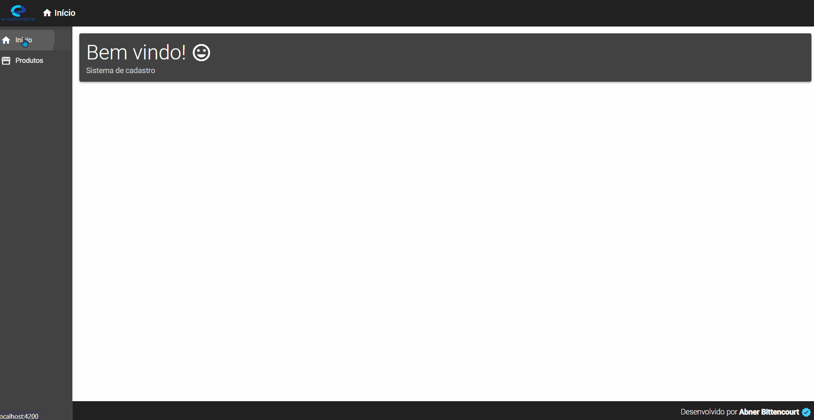

# CRUD for E-commerce

This project was built for the purpose of learning the Angular 9, however, already updated to version 11 of the framework, and basically consists of a register of products with the possibility of creating, reading, updating and deleting (CRUD).

PT_BR => Este projeto foi construído com a finalidade de aprendizado do Angular 9, porém, já atualizado para a versão 11 do framework, e consiste basicamente em um cadastro de produtos com possibilidade de criação, leitura, atualização e exclusão (CRUD).

## Initializing Backend

Run `npm start` inside the backend folder to start the .json API made for the back end of this application.

## Initializing server

Run `ng serve -o` inside the frontend folder to start server. Navigate to `http://localhost:4200/`.

## CRUD in operation

  

## Technologies

PT_BR => Esse projeto foi desenvolvido com as seguintes tecnologias:  
EN => This project was developed with the following technologies:

- ✔️ HTML5

- ✔️ CSS3

- ✔️ Javascript

- ✔️ Angular 11

- ✔️ JSON Server
